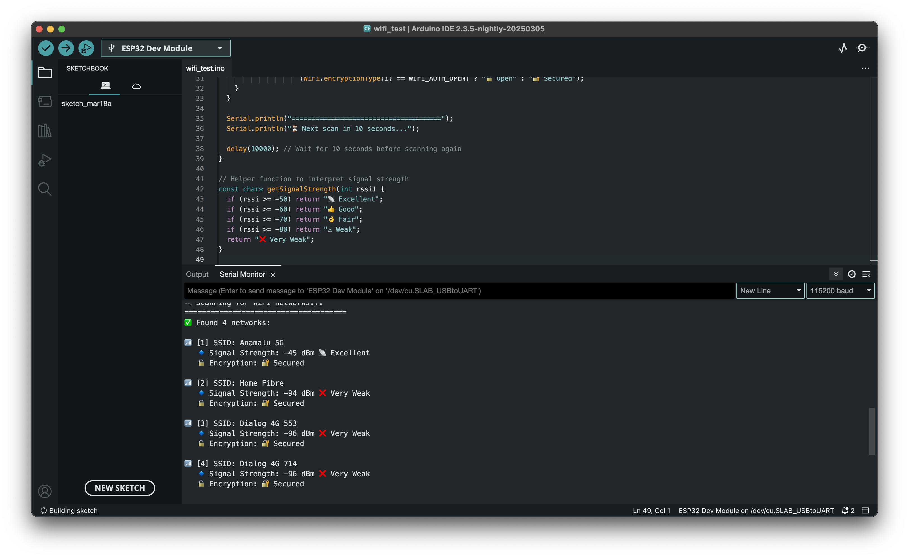

# ESP32 WiFi Scanner 🚀

This is an ESP32-based WiFi scanner that detects available networks and displays their SSID, signal strength (RSSI), and encryption type.

## 📌 Features
- Scans nearby WiFi networks every 10 seconds
- Displays SSID, RSSI, and security type
- Works with ESP32 boards

## 📖 Setup
1. Install **Arduino IDE** and the **ESP32 Board Manager**.
2. Upload the `wifi_scanner.ino` file to your ESP32.
3. Open the Serial Monitor at **115200 baud** to view detected networks.

## 🛠️ Hardware Requirements
- ESP32 development board
- USB cable for programming

## 📸 Screenshot

_Sample output from the WiFi scanner showing detected networks_

